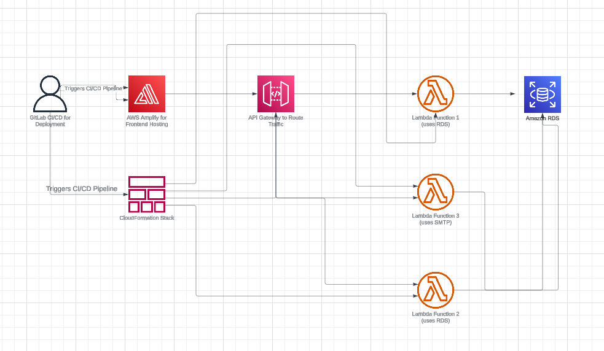

# NookTrip Backend

This repository contains the backend code for the NookTrip project, a travel itinerary management system.

## Cloud Architecture

## Project Structure

The project is organized into several main components:

- `NOOK-FUNCTIONS/`: Contains AWS Lambda functions for various services.
  - `emails/`: Email service for sending itineraries.
  - `itineraries/`: Itinerary management service.
- `ORM/`: Database models and migrations using SQLAlchemy.
- `Template/`: HTML templates for email content.
- `Zops/`: Additional scripts and utilities.

## Main Components

### NOOK-FUNCTIONS

#### Emails Service

Located in `NOOK-FUNCTIONS/emails/`, this service is responsible for sending personalized itinerary emails to users.

Key files:
- `lambda_function.py`: Contains the main logic for processing and sending emails.
- `models.py`: Defines data models used in the email service.
- `requirements.txt`: Lists the Python dependencies for the email service.
- `Standard version-2.html`: HTML template for the itinerary emails.

The email service uses Gmail SMTP for sending emails and retrieves sensitive information from AWS Secrets Manager.

#### Itineraries Service

Located in `NOOK-FUNCTIONS/itineraries/`, this service manages the creation and retrieval of travel itineraries.

Key files:
- `lambda_function.py`: Contains the main logic for itinerary management.
- `requirements.txt`: Lists the Python dependencies for the itinerary service.

### ORM

The `ORM/` directory contains database models and migration scripts using SQLAlchemy.

Key files:
- `models.py`: Defines the database schema and models.
- `versions/`: Contains database migration scripts.

### Template

The `Template/` directory contains HTML templates used for generating email content.

### Zops

The `Zops/` directory contains additional scripts and utilities used in the project.

## Setup and Deployment

The project uses AWS SAM (Serverless Application Model) for deployment, as defined in `NOOK-FUNCTIONS/template.yml`.

Key configuration:
- AWS Lambda functions for email and itinerary services.
- S3 bucket for storing images used in email templates.
- IAM roles and policies for Lambda function execution.
- AWS Secrets Manager for storing sensitive information.

## Usage

To use this backend:

1. Ensure all required AWS services are set up (Lambda, S3, Secrets Manager).
2. Deploy the SAM template using AWS CLI or AWS SAM CLI.
3. Upload email template images to the created S3 bucket.
4. Set up the required secrets in AWS Secrets Manager.
5. Test the Lambda functions using the AWS Console or API Gateway.

## Development

For local development and testing:

1. Install the required dependencies listed in the `requirements.txt` files.
2. Use the AWS SAM CLI for local testing of Lambda functions.
3. Ensure proper AWS credentials are set up for accessing AWS services.

## CI/CD

The project includes CI/CD configuration:
- `.gitlab-ci.yml`: GitLab CI/CD pipeline configuration.
- `.github/workflows/NOOK-FUNCTIONS.yml`: GitHub Actions workflow for the NOOK-FUNCTIONS component.

These pipelines automate the testing and deployment processes for the project.